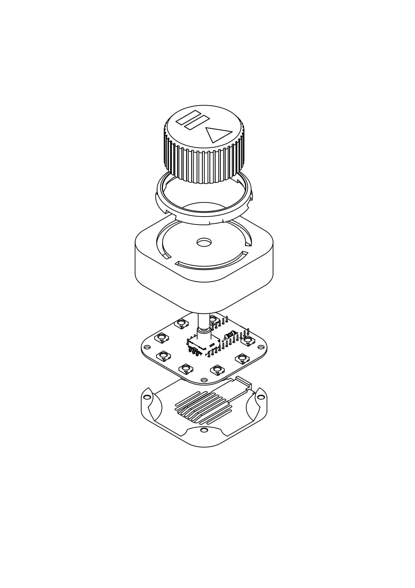
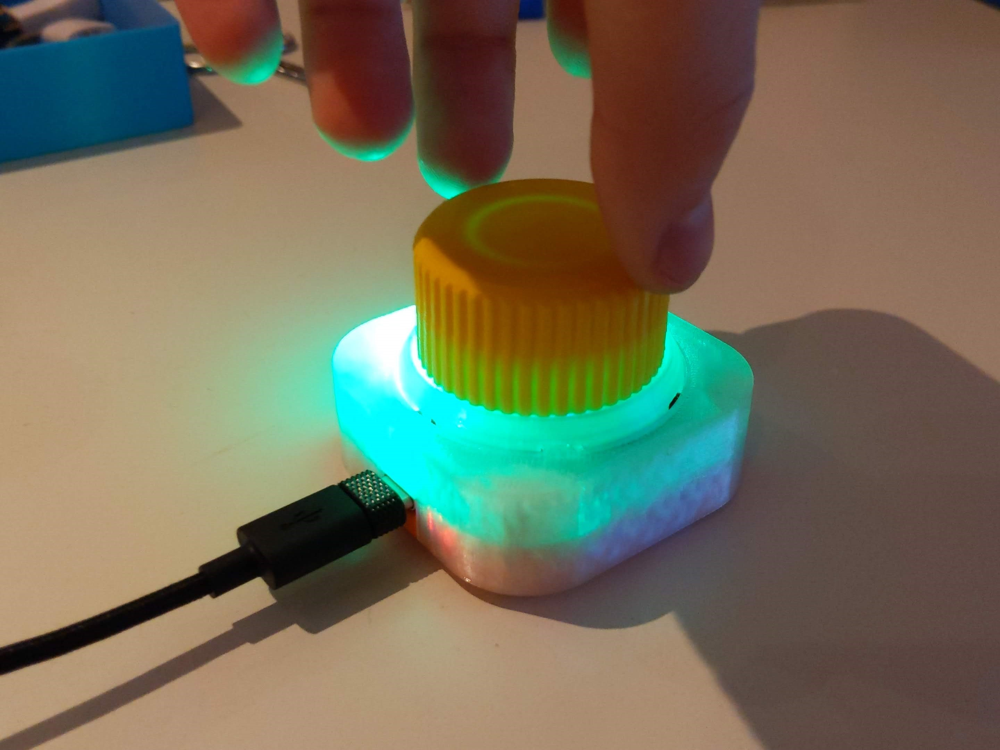
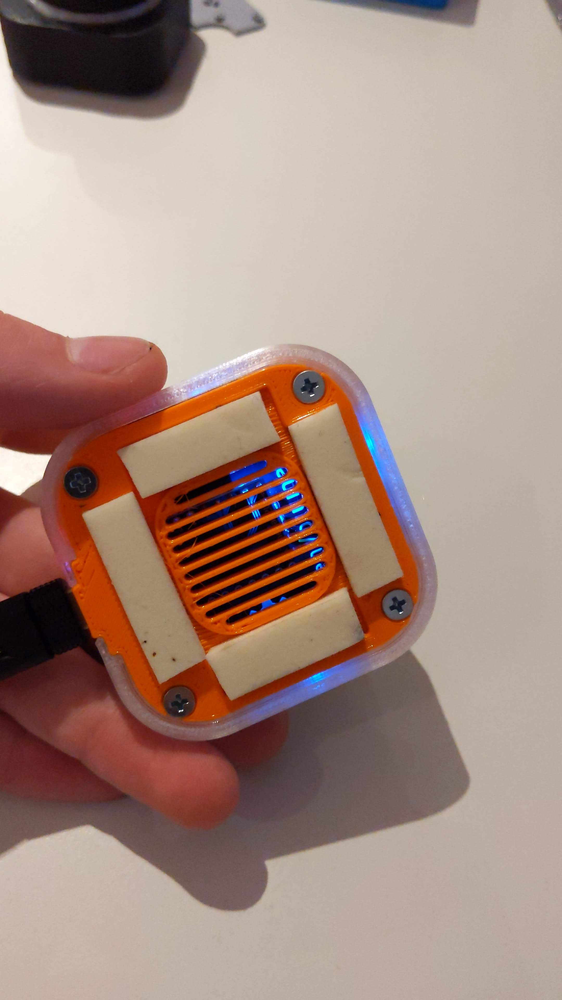
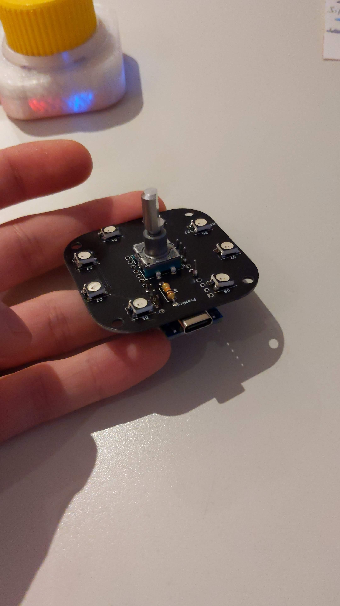
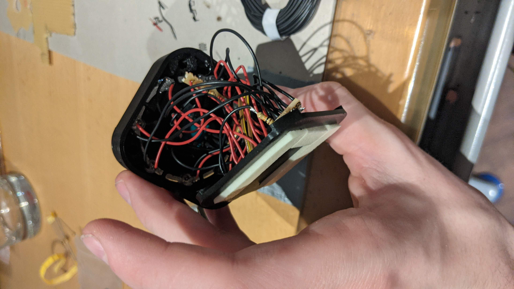

# Volume Knob V2 (USB-C)

A compact USB volume knob based on an **Arduino Pro Micro (USB-C)**. Turn it to change your computer's volume, click to mute – and eight RGB LEDs under a transparent ring give visual feedback with selectable colors and animations.

The knob shows up as a standard USB media keyboard, so it works on Windows, macOS and Linux without any drivers.


**3D-printable parts, photos and more:** [Printables – Volume Knob V2 (USB-C)](https://www.printables.com/model/154855-volume-knob-v2-usb-c)

---

## Features

- Volume up / down by turning the knob, mute by clicking it
- 8 addressable RGB LEDs (SK6812) behind a clear printed ring
- 25 selectable colors
- Several LED animation modes
- Color and mode are stored in EEPROM and survive unplugging
- USB-C, plug & play (USB HID consumer control)
- Roughly **€20** in parts per knob

## Bill of Materials

| Qty | Part | Notes |
|---:|---|---|
| 1 | Arduino Pro Micro (ATmega32U4, **USB-C**) | 5 V / 16 MHz |
| 8 | SK6812 RGB LED, 5050 package | WS2812B-compatible |
| 1 | ALPS rotary encoder with push switch | |
| 1 | 10 kΩ resistor | |
| 1 | Custom PCB | KiCad project and Gerbers in this repo |
| 4 | M3 × 16 screws | |
| 4 | M3 threaded inserts | |
| – | PLA + clear/transparent filament | for the housing and the light ring |

## 3D Printing

All parts print fine in **PLA**. Print the **light ring in transparent filament** so the LEDs shine through. The bottom can optionally be printed with a decorative pattern – an *Octagram Spiral* top/bottom surface pattern looks great.

The print files are on [Printables](https://www.printables.com/model/154855-volume-knob-v2-usb-c); the source CAD files (Autodesk Inventor, STEP, STL) are in [`ProMicroKiCad-master/VolumeKnob/3DObjekt`](ProMicroKiCad-master/VolumeKnob/3DObjekt).



## Assembly

1. Solder the rotary encoder, the Arduino Pro Micro and the resistor onto the PCB.
2. Melt the four M3 threaded inserts into the holes of the bottom housing.
3. Snap the transparent ring into the housing (snap-fit, no glue needed).
4. Fasten the PCB assembly with the four M3 screws.
5. Press the knob onto the encoder shaft – it's a press fit, no adhesive required.



## Wiring

| Pro Micro pin | Connected to |
|---:|---|
| 7 | LED data in (SK6812 chain) |
| 6 | Encoder CLK (A) |
| 5 | Encoder DT (B) |
| 2 | Encoder push button (SW) |

## Firmware

The sketch is located at [`volumeKnob/volumeKnob.ino`](volumeKnob/volumeKnob.ino).

### Required libraries

Install via the Arduino Library Manager:

- [HID-Project](https://github.com/NicoHood/HID) by NicoHood – USB media keys
- [Encoder](https://github.com/PaulStoffregen/Encoder) by Paul Stoffregen
- [Adafruit NeoPixel](https://github.com/adafruit/Adafruit_NeoPixel)
- [OneButton](https://github.com/mathertel/OneButton) by Matthias Hertel
- EEPROM (included with the Arduino IDE)

### Upload

1. Select the board **Arduino Leonardo** (or *SparkFun Pro Micro, 5 V / 16 MHz* if you have the SparkFun board package installed).
2. Choose the correct port and upload.

If you use a different number of LEDs, change `NUMPIXELS` at the top of the sketch.

> **Note:** On startup the knob sends 50× *Volume Down* followed by 2× *Volume Up*, so your system volume is set to a low, known level every time it is plugged in.

## Usage

| Action | Volume mode | Color menu | Mode menu |
|---|---|---|---|
| **Turn** | Volume up / down | Browse the 25 colors | Browse the animation modes |
| **Click** | Mute / unmute | Save color & go back | Save mode & go back |
| **Long press** | Open color menu | Open mode menu | Back to volume mode (without saving) |

Two encoder detents equal one volume step.

### LED modes

- **Single pixel** – one LED follows the knob and slowly fades out
- **Rainbow fade** – all LEDs fade through the color wheel
- **Rainbow wheel** – a rotating rainbow around the ring
- **Pixel trail** – three LEDs follow the knob and stay lit

In the mode menu the modes are arranged in groups around the ring, separated by a dark position.

## Repository Structure

```
Volume-Knob/
├── volumeKnob/volumeKnob.ino          # current firmware (V2)
├── images/                            # photos and GIFs
└── ProMicroKiCad-master/
    ├── VolumeKnob/
    │   ├── VolumeKnob.kicad_pro/_sch/_pcb   # KiCad project of the PCB
    │   ├── jlcpcb/                     # Gerber, BOM & CPL for JLCPCB
    │   ├── Gerber/                     # older Gerber revisions
    │   ├── 3DObjekt/                   # Inventor / STEP / STL files
    │   └── Code/                       # older sketches and test code
    └── ProMicroKiCad-master/           # Pro Micro KiCad library
```

## Gallery

 

## Version 1

The first version used a micro-USB Pro Micro, single-color green LEDs and a hand-wired build (8× green LEDs, 2× 10 kΩ resistors). Using individual LEDs instead of a ring PCB wasn't the best idea – it took some hot glue to hold everything in place – which led to the V2 with a custom PCB, RGB LEDs and USB-C.

 

---

Made by **Max Siebenschläfer** – find more projects on [Printables](https://www.printables.com/model/154855-volume-knob-v2-usb-c).
